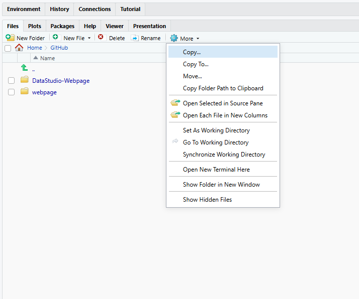
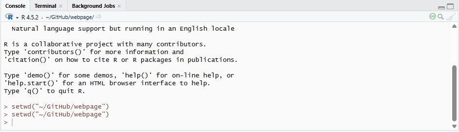

今回は、特に初心者にありがちなエラーを10個選んで解説していきます。

慣れてきた頃にもやりがちです。特に1と９。でもなれるとすぐに原因がわかり、すぐに直せるようになるので、何度も挑戦しましょう。

## 1. object 'x' not found

これは本当によくあります。直すのはものすごく簡単で、

``` r
x = 8
```

など、xに何かを割り当てれば終わりです。

もう一つの原因はスペルミスです。自分の場合は、特にオブジェクトの名前を無駄に長くしてしまった時にあります。

オブジェクトの名前が、例えばxではなくreinasdatastudioの場合で、スペルミスをしてしまった時は、

``` r
object 'reinasdatastudi' not found
```

などと、自分が打ったスペルミスが表示されるので、しっかり確認してみてください。

+---------------------+------------------------------------------------------+
| エラー              | Error: object 'x' not found                          |
+---------------------+------------------------------------------------------+
| 意味                | 指定したオブジェクト（変数やデータ）が存在しません。 |
+---------------------+------------------------------------------------------+
| よくある原因        | -   オブジェクト名のスペルミス                       |
|                     | -   データを読み込んでいない                         |
|                     | -   オブジェクトを作る前に使っている                 |
+---------------------+------------------------------------------------------+
| 解決方法            | オブジェクトが存在するか確認します。                 |
|                     |                                                      |
|                     | ``` r                                                |
|                     | ls()                                                 |
|                     | ```                                                  |
|                     |                                                      |
|                     | また、スペルミスがないか確認します。                 |
+---------------------+------------------------------------------------------+

## 2. unexpected symbol

+--------------+-----------------------------------------------------------------------+
| エラー       | Error: unexpected symbol                                              |
+--------------+-----------------------------------------------------------------------+
| 意味         | コードの構文が正しくありません。                                      |
+--------------+-----------------------------------------------------------------------+
| よくある原因 | -   コンマ , の不足                                                   |
|              | -   カッコ () の閉じ忘れ                                              |
|              | -   パイプ %\>% の位置ミス                                            |
+--------------+-----------------------------------------------------------------------+
| 解決方法     | コードの構文を確認します。 特にカッコやコンマの位置をチェックします。 |
+--------------+-----------------------------------------------------------------------+

## 3. argument is missing, with no default

例えばfunction（関数）を使うときに、

```         
my_func <- function(x,y)
```

なのに、間違えて

```         
my_func(1, )
や
my_func(1)
```

など、その関数にあったargument（引数）が使われていない時のエラーです。

この例の場合、正しいのは

```         
my_func(1,2)
```

など、xとyが何なのかを指定しないといけません。

+---------------+------------------------------------------------------+
| エラー        | Error: argument is missing, with no default          |
+---------------+------------------------------------------------------+
| 意味          | 関数に必要な引数が指定されていません。               |
+---------------+------------------------------------------------------+
| よくある原因  | -   必須引数を指定していない                         |
|               | -   コンマの書き忘れ                                 |
+---------------+------------------------------------------------------+
| 解決方法      | 関数の引数を確認します。                             |
|               |                                                      |
|               | ```                                                  |
|               | ?function_name                                       |
|               | ```                                                  |
+---------------+------------------------------------------------------+

## 4. non-numeric argument to binary operator

たまに、数字に見えてもRはそれをstringなどと認識している場合があるので、ちゃんとclassがnumericなのを確認しましょう。

+---------------+------------------------------------------------------+
| エラー        | Error: non-numeric argument to binary operator       |
+---------------+------------------------------------------------------+
| 意味          | 数値ではないデータに対して計算を行おうとしています。 |
+---------------+------------------------------------------------------+
| よくある原因  | -   文字列データを計算している                       |
|               | -   数値として読み込まれていない                     |
+---------------+------------------------------------------------------+
| 解決方法      | データ型を確認します。                               |
|               |                                                      |
|               | ```                                                  |
|               | class(x)                                             |
|               | ```                                                  |
|               |                                                      |
|               | 必要なら数値に変換します。                           |
|               |                                                      |
|               | ```                                                  |
|               | as.numeric(x)                                        |
|               | ```                                                  |
+---------------+------------------------------------------------------+

## 5. cannot open the connection

これは最初はすごく複雑です。わかりやすく説明しますと、

**Rが指定されたファイルを見つけられない、または開けないときに出ます。**

一番よくある原因は、Rに伝えたファイルの場所が、今作業中のフォルダの中にないときです。例えば、

```         
read.csv("data.csv")
```

でファイルを開こうとしても、Rが今作業しているフォルダ、すなわちDirectoryにそのデータファイルがないとRはそれを開けません。

RStudioを開けた時の右側のMoreと書かれているギアアイコンをクリックすると、今どこのDirectoryで作業しているのかを確認できます。Go To Working Directory（今作業中のDirectoryに行く）をクリックすれば、Rが今見ているフォルダーを開いてくれます。

違うDirectoryに変えたい場合は、作業したいフォルダーに行ってから、Set As Working Directory（このフォルダーをDirectoryにする）をクリックしてください。

{width="492"}

これらのステップをコンソールでしたいなら、以下の通りsetwdでDirectoryにしたいフォルダーの場所(Path)を指定します。

{width="518"}

経験上自分が一番最初てこずったエラーです。

ほかの原因は、データファイルのスペルミス、ダブルクォーテーション（””）の入れ忘れなどもあるので、ちゃんとファイルの名前が正しく書かれているか確認しましょう。

+---------------+------------------------------------------------------+
| エラー        | Error: cannot open the connection                    |
+---------------+------------------------------------------------------+
| 意味          | ファイルやURLを開くことができません。                |
+---------------+------------------------------------------------------+
| よくある原因  | -   ファイルパスが間違っている                       |
|               | -   ファイルが存在しない                             |
|               | -   作業ディレクトリが違う                           |
+---------------+------------------------------------------------------+
| 解決方法      | 現在の作業ディレクトリを確認します。                 |
|               |                                                      |
|               | getwd()                                              |
|               |                                                      |
|               | 必要なら変更します。                                 |
|               |                                                      |
|               | setwd("path")                                        |
+---------------+------------------------------------------------------+

## 6. object of type 'closure' is not subsettable

あまり聞かないエラーですが、例えば変数（Variable）の名前が関数（Function）の名前と同じだったりした時にでます。Rが変数を関数と勘違いしてしまいます。

+---------------+------------------------------------------------------+
| エラー        | Error: object of type 'closure' is not subsettable   |
+---------------+------------------------------------------------------+
| 意味          | 関数をデータのように扱っています。                   |
+---------------+------------------------------------------------------+
| よくある原因  | 関数名とオブジェクト名が同じ。                       |
|               |                                                      |
|               | ```                                                  |
|               | 例：mean[1]                                          |
|               | ```                                                  |
+---------------+------------------------------------------------------+
| 解決方法      | 関数ではなくデータを指定します。                     |
|               |                                                      |
|               | ```                                                  |
|               | 例：mean(c(1,2,3))                                   |
|               | ```                                                  |
+---------------+------------------------------------------------------+

## 7. replacement has length zero

+---------------+------------------------------------------------------+
| エラー        | Error: replacement has length zero                   |
+---------------+------------------------------------------------------+
| 意味          | 空の値を代入しようとしています。                     |
+---------------+------------------------------------------------------+
| よくある原因  | -   条件に一致するデータが存在しない                 |
|               | -   インデックスが空になっている                     |
+---------------+------------------------------------------------------+
| 解決方法      | データの長さを確認します。                           |
|               |                                                      |
|               | ```                                                  |
|               | length(x)                                            |
|               | ```                                                  |
+---------------+------------------------------------------------------+

## 8. subscript out of bounds

７同様、まだシンプルなエラーですね。

+---------------+------------------------------------------------------+
| エラー        | Error: subscript out of bounds                       |
+---------------+------------------------------------------------------+
| 意味          | 存在しない位置の要素にアクセスしています。           |
+---------------+------------------------------------------------------+
| よくある原因  | データのサイズより大きい番号を指定している。         |
|               |                                                      |
|               | 例：x\[10\]                                          |
|               |                                                      |
|               | （データが5個しかない場合）                          |
+---------------+------------------------------------------------------+
| 解決方法      | データのサイズを確認します。                         |
|               |                                                      |
|               | length(x)                                            |
+---------------+------------------------------------------------------+

## 9. could not find function

+---------------+------------------------------------------------------+
| エラー        | Error: could not find function                       |
+---------------+------------------------------------------------------+
| 意味          | 関数が見つかりません。                               |
+---------------+------------------------------------------------------+
| よくある原因  | -   パッケージを読み込んでいない                     |
|               | -   関数名のスペルミス                               |
+---------------+------------------------------------------------------+
| 解決方法      | パッケージをロードします。                           |
|               |                                                      |
|               | library(dplyr)                                       |
+---------------+------------------------------------------------------+

## 10. NA/NaN argument

ちなみに、欠損値があるか確認する方法は複数あります。

```         
anyNA(data)
```

はデータの中に欠損値があればTRUE、なければFALSEが出ます。

```         
sum(is.na(data))
```

は、何個TRUE、つまりNA/欠損値があるか確認します。

そしてデータのコラムごとに確認したい場合は、

```         
colSums(is.na(data))
```

と入力するとどのコラムに何個NAがあるか確認できます。

+---------------+------------------------------------------------------+
| エラー        | Error: NA/NaN argument                               |
+---------------+------------------------------------------------------+
| 意味          | 計算にNAやNaNが含まれています。                      |
+---------------+------------------------------------------------------+
| よくある原因  | データに欠損値がある。                               |
+---------------+------------------------------------------------------+
| 解決方法      | NAを除外して計算します。                             |
|               |                                                      |
|               | ```                                                  |
|               | mean(x, na.rm = TRUE)                                |
|               | ```                                                  |
+---------------+------------------------------------------------------+

説明が分かりにくかったり、質問があれば、ぜひ教えてください。

たくさんの人とRを通じて、Rのすばらしさや面白さをシェア出来るのを楽しみにしています！

他にもRのことで質問や相談があれば、気軽にご連絡ください。

[日本語でRコンサルティング](../../ja.qmd)をしています。

Email: reinasdatastudio\@gmail.com
