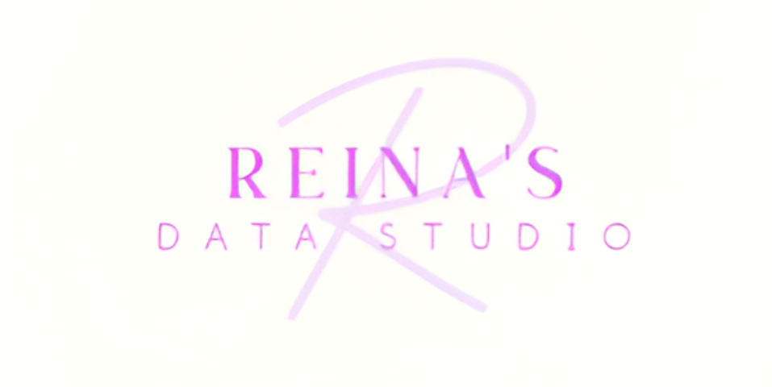

---
format:
  html:
    page-layout: full
    toc: false
---

:::::: {.hero-banner .banner}
::::: hero
::: hero-image

:::

# R Consulting for Healthcare & Research

::: hero-sentence
*Practical, ethical data solutions - By a former pharmacist with clinical context*
:::

<button class="button">

[Work with me](enquiry.qmd)

</button>

Send your problem - Get a reply within 24-48 hours.

## Why work with me?

-   Healthcare background
-   Experience with real clinical data structures
-   Clear communication for non-programmers
-   Reproducible, well-documented R workflows
-   Respect for data privacy and ethics
:::::
::::::

:::::: {.banner .section-story}
::: box-1
## How it works

1.  <strong>**Initial enquiry**</strong>

    You send a short message describing your data, question or problem.

2.  <strong>**Quick discussion**</strong>

    We clarify your goals, timeline and the type of support that suits you best.

3.  <strong>**Tailored support and delivery**</strong>

    I provide clean R code, clear explanations, and practical next steps you can reuse with confidence.

4.  <strong>**Optional: Ongoing support**</strong>
:::

::: box-2
## Who I help

-   Healthcare & life-science researchers
-   Students learning R or statistics
-   Healthcare professionals working with data
-   Small teams needing reliable R support
-   Anyone who wants clear, ethical data analysis

If you’re unsure whether your project fits, feel free to ask.
:::

::: box-3
## Tools

-   R / tidyverse
-   ggplot2
-   Shiny dashboards
-   Quarto / R Markdown
-   Statistical modelling and inference
-   Forecasting (ARIMA, Prophet)
-   Healthcare & pharmacy-related data
:::
::::::

::::::: {.section-services .banner}
# Services

I offer **clear, practical R support** — from quick problem-solving to ongoing collaboration. If you’re unsure which option fits your situation, feel free to get in touch and I’ll guide you.

::: card
## Quick Fix (1-2 hours)

#### **Best for**

Small problems, urgent questions or when you are stuck and need clarity fast.

Typical use cases:

-   Debugging R scripts
-   Help with plots, statistics or models
-   Data wrangling issues
-   Understanding error messages or unexpected results

#### **What you get**

-   Live 1:1 session (or async support, if preferred)
-   Clear explanation in plain English
-   Improved or corrected R code you can reuse

#### **Pricing**

From NZD 200 to 300 per hour (1-2 hour sessions)
:::

::: card
## Reproducible Analysis & Report

#### **Best for**

Healthcare and research projects that need clean, defensible, and reusable results.

Typical use cases:

-   Clinical or research data analysis
-   Statistical modelling and interpretation
-   Automated reports using Quarto / R Markdown
-   Forecasting and exploratory analysis

#### **What you get**

-   Clean, well-structured R code
-   Reproducible analysis pipeline
-   Publication- or stakeholder-ready report
-   Clear written interpretation of results

#### **Pricing**

From NZD 1,990-5,700 per project

*(Scope and pricing depend on scope, project size and timeline)*
:::

::: card
## Ongoing R Support (Retainer)

#### **Best for**

Teams or individuals who want reliable, long-term R support without hiring full-time.

Typical use cases:

-   Regular analysis or reporting work
-   Code review and workflow improvement
-   Mentoring and upskilling
-   Ongoing troubleshooting and advice

#### **What you get**

-   A fixed number of support hours per month
-   Priority response
-   Consistent, context-aware support
-   A long-term collaborator who understands your data

*Available on a monthly basis.*

#### **Pricing**

From NZD 1,490-4000 per month

*(e.g. 6-20 hours/month; custom arrangements available)*
:::

::: card
## R Teaching and Mentoring

If you’re learning R or want to improve how you work with data, I also offer **1:1 or small-group teaching** tailored to your background and goals.

This may include:

-   Learning R from a healthcare or research perspective
-   Understanding statistics through practical examples
-   Building reproducible workflows with confidence

#### **Pricing**

From NZD 160-250 per hour

*(Discounts available for students)*
:::

### Not sure which option fits?

If you have a dataset, question, or project in mind, feel free to reach out. I’ll help you choose the most suitable option at no cost.

<button class="button">

[Enquiry](enquiry.qmd)

</button>
:::::::

:::::: {.youtube-section .banner}
## Learn with me on YouTube

I share practical R tutorials focused on real-world data problems.

::::: channels
::: youtube-channel
## English version

[Reina's Data Studio](https://www.youtube.com/@reinas_data.studio)

<iframe src="https://www.youtube.com/embed/ViNVCBWXYak?si=ewS521FpIrfK0TtU" title="YouTube video player" frameborder="0" allow="accelerometer; autoplay; clipboard-write; encrypted-media; gyroscope; picture-in-picture; web-share" referrerpolicy="strict-origin-when-cross-origin" allowfullscreen>

</iframe>
:::

::: youtube-channel
## Japanese version

[Reina's Data Studio JP](https://www.youtube.com/@reinas_data.studio_jp)

<iframe src="https://www.youtube.com/embed/9rVpTYfIIoE?si=5LiSqHWX3YTB0clA" title="YouTube video player" frameborder="0" allow="accelerometer; autoplay; clipboard-write; encrypted-media; gyroscope; picture-in-picture; web-share" referrerpolicy="strict-origin-when-cross-origin" allowfullscreen>

</iframe>
:::
:::::
::::::

::::: {.section-contacts .banner}
::: language
## Language Support

Consultations and support available in **English or Japanese**
:::

::: contact
## Contact

If you have a dataset, question or project in mind, feel free to reach out.

I typically respond within **24-48 hours**.
:::

<button class="button">

[Send an enquiry](enquiry.qmd)

</button>
:::::
