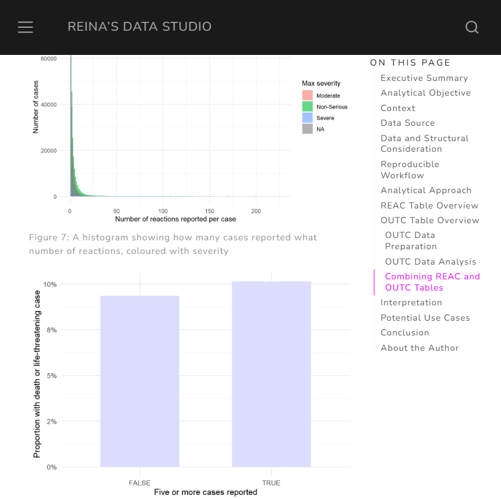
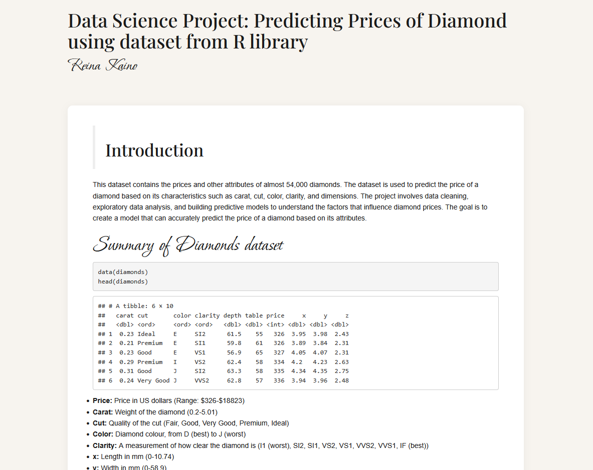
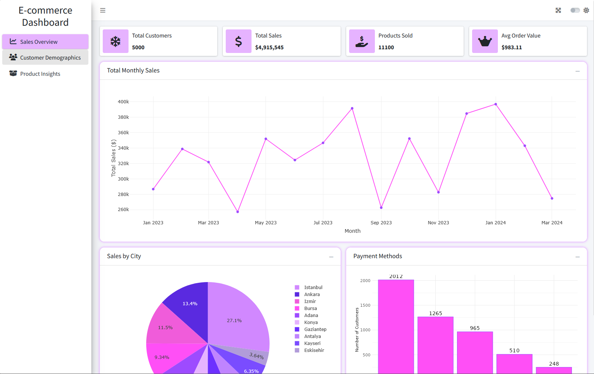
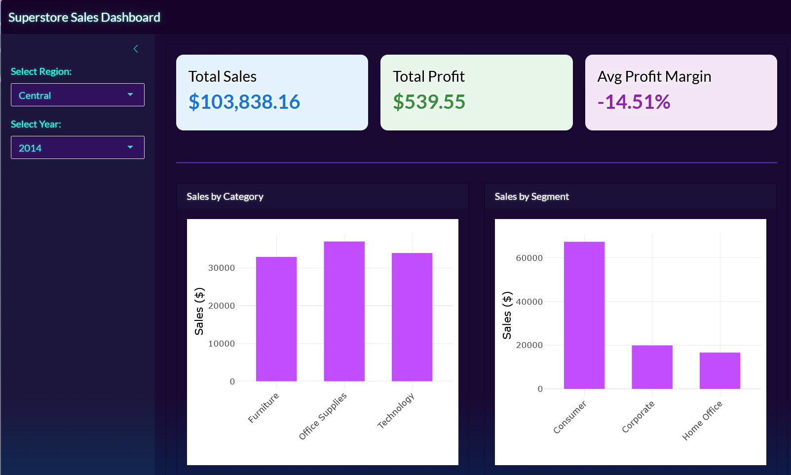

These selected projects demonstrate how I approach data: with **clarity, reproducibility, and practical outcomes**.

For confidential client work, details may be limited.

::::::::::::::: healthcare-box
## Healthcare and Research Projects

Projects demonstrating clinical context, statistical analysis and reproducible R workflows.

::::: project-container
::: project-image

:::

::: projects
### [Exploring Potential Drug Safety Signals using the FDA Adverse Event Reporting System (FAERS)](https://reinasdatastudio.github.io/faers-pharmacovigilance-analysis/FAERS_Report.html)

#### Context

Explored the FAERS dataset further: This time with extensive data cleaning and data aggregation of REAC, DRUG and DEMO files to further analyse the most commonly reported drugs that cause fatigue and death.

- Many rows in the dataset contain duplicates - DEMO file ensured only the latest primary ID was used
- DEMO file was joined with REAC and DRUG files to ensure those with the same age, sex and the country of residence was not mistakenly de-duplicated
- The combined data was used to visualise the most commonly reported adverse effects
- "Fatigue" and "Death" were among the top most commonly reported adverse effects, therefore the most commonly reported drugs for those adverse effects were further analysed
- Reporting Odds Ratio was used to find the proportion of adverse effects reported for the most commonly reported drugs

#### Outcome

- The top three commonly reported drugs that caused fatigue were Duplilumab, Human Immunogloblin G and Vedolizumab
- The top most commonly reported drug that caused death was Dapagliflozin
- The ROR of Dupilumab was 0.39 with CI of 0.35 and 0.43, meaning it reported fatigue less compared with other drugs
- The ROR of Dapagliflozin was 8.12 with CI of 7.51 and 8.78, indicating disproportionate reporting of death among reports involving dapagliflozin relative to other medications in the database

Despite there results, FAERS data must be interpreted carefully. The database is based on spontaneous reporting and is therefore subject to substantial reporting bias, incomplete information, duplicate reports, and confounding factors. Consequently, findings generated from FAERS analyses should be viewed as hypothesis-generating rather than evidence of causality.

#### [GitHub repository](https://github.com/reinasdatastudio/faers-pharmacovigilance-analysis)

#### [Full Report](https://reinasdatastudio.github.io/faers-pharmacovigilance-analysis/FAERS_Report.html)

#### YouTube Tutorials:

- [Part 1 \| Data Cleaning and Preprocessing](https://youtu.be/g4BIA83Us6Q)

- [Part 2 \| Joining Data, Visualisation and ROR](https://youtu.be/ZY7ZhC5v8_w){.uri}
:::
:::::

::::: project-container
::: project-image

:::

::: projects
### [Reproducible Pharmacovigilance Analysis Using FAERS](projects/FAERS2025Q3.qmd)

Reproducible exploratory analysis of pharmacovigilance data using FAERS.

#### **Context**

Analysed the FDA Adverse Event Reporting System (FAERS) 2025 Q3 dataset to examine reporting patterns in adverse reactions (REAC) and clinical outcomes (OUTC).

- Case-level aggregation
- Handling duplicate reports
- Cautious interpretation of spontaneous reporting data.

#### **Outcome**

Delivered a structured R workflow demonstrating how large healthcare safety datasets can be cleaned, explored, and interpreted reproducibly.

- Frequently reported reactions do not necessarily correspond to severe outcomes
- Importance of separating reporting frequency from clinical significance

#### [GitHub repository](https://github.com/reinasdatastudio/faers-reproducible-workflow)
:::
:::::

::::: project-container
::: project-image

:::

::: projects
### [Clinical Trial Analysis of Hypertension Treatments](projects/Hypertension-clinical-tx.Rmd)

Reproducible clinical data analysis with clear interpretation for treatment comparison.

#### **Context**

Simulated clinical trial dataset comparing treatment outcomes for hypertension patients.

- Cleaned and structured clinical variables
- Performed statistical comparison between treatment groups
- Created publication-style visualisations
- Documented assumptions and analytical workflow

#### **Outcome**

Delivered a reproducible analysis pipeline and clear statistical interpretation that could be reused across similar trials.

- Structured R analysis script
- Cleaned dataset
- Visualisations suitable for reporting
- Written interpretation of results

#### [GitHub repository](https://github.com/reinasdatastudio/clinical-trial-hypertension-analysis)
:::
:::::

::::: project-container
::: project-image

:::

::: projects
### [Machine Learning for Cancer Variant Pathogenicity Classification](https://www.kaggle.com/code/reinagraham/cancer-variant-dataset-machine-learning-using-r)

#### **Context**

Explored different machine learning models such as Random Forest to differentiate and predict benign and pathogenic genetic variants using a Kaggle dataset. Variables include:

- Chromosomes
- Genes
- PolyPhen

#### Outcome

- Clear data visualisation
- Clear interpretation of data
  - Accuracy alone can be misleading, especially with imbalanced data
  - There is often a trade-off between overall accuracy and balanced predictions
  - Real-world data problems are rarely clean and that understanding the limitations of a model is just as important as building one.
  
#### [GitHub repository](https://github.com/reinasdatastudio/cancer-variant-machine-learning)
:::
:::::
:::::::::::::::

::::::::::::::: general-box
## Data Science and General Analytics

Broader data science projects showcasing modelling, visualisation and application design.

::::: project-container
::: project-image

:::

::: projects
### [Diamond Price Prediction using Statistical and Machine Learning Models](projects/diamonds_portfolio.Rmd)

**Statistical exploration and modelling of pricing factors in a high-dimensional dataset.**

#### **Context**

Dataset analysing how characteristics influence diamond pricing.

- Cleaned and explored multivariate data
- Built regression models to assess price drivers
- Visualised relationships between features and pricing

#### **Outcome**

Identified key variables influencing price and demonstrated reproducible modelling workflow.

- Reproducible R script
- Model output and interpretation
- Visualisations

#### [GitHub repository](https://github.com/reinasdatastudio/diamond-price-prediction)
:::
:::::

::::: project-container
::: project-image

:::

::: projects
### [e-commerce Sales Analysis Dashboard](https://thequeenofdata.shinyapps.io/ecommerceDashboardExample/)

**Interactive R Shiny dashboard enabling non-technical users to explore sales performance.**

#### **Context**

Retail-style dataset requiring dynamic filtering and real-time data exploration.

- Designed and built an interactive Shiny application
- Implemented reactive filters and summary panels
- Created dynamic visualisations for performance tracking

#### **Outcome**

Delivered a user-friendly dashboard that allows stakeholders to explore trends and metrics of sales, customer behaviour and product analysis without writing code.

- Fully functional Shiny application
- Structured and documented R code
- Deployment-ready project structure

#### [GitHub repository](https://github.com/reinasdatastudio/ecommerce-sales-dashboard)
:::
:::::

::::: project-container
::: project-image
### 
:::

::: projects
### [Superstore R Shiny Dashboard](https://thequeenofdata.shinyapps.io/Superstore/)

**Exploratory data analysis and visualisation of retail sales data.**

#### **Context**

Multi-variable retail dataset examining sales performance across regions and categories.

- Cleaned and prepared transactional data
- Conducted exploratory data analysis
- Built visualisations to highlight key trends and patterns
- Identified performance drivers and segment differences

#### **Outcome**

Produced actionable insights into sales distribution, regional performance, and product trends.

- Structured R analysis script
- Clear visualisations
- Summary of findings

#### [GitHub repository](https://github.com/reinasdatastudio/superstore-business-intelligence-dashboard)
:::
:::::

::::: project-container

::: project-image

:::

::: projects
### [Sales Analysis of a Coffee Shop with Power BI](projects/PowerBI_COffeeShop.qmd)
A Power BI dashboard providing insight into Store Performance, Peak Sale Times and Product Trends.

:::
:::::
:::::::::::::::

\

If you're working on a healthcare, research, or data-driven project and need clear, reproducible R support, feel free to get in touch.

<button class="button">

[Send an enquiry](enquiry.qmd)

</button>
